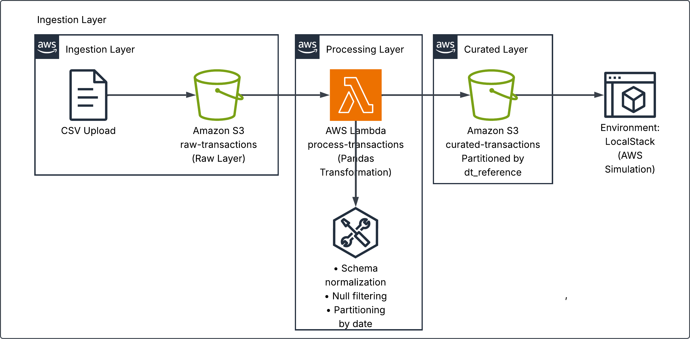

# Event-Driven Mini Data Lake on AWS (LocalStack)

This project simulates an event-driven data lake architecture using AWS services via LocalStack.

The pipeline ingests CSV transaction files into a raw S3 bucket, processes them using AWS Lambda (with Pandas), and stores curated, partitioned data in a separate S3 bucket.

The goal is to demonstrate serverless data engineering patterns, infrastructure setup, packaging strategies, and architectural trade-offs when working with AWS Lambda.

---

## 🏗️ Architecture




---

## 🧰 Technologies Used

- Amazon Web Services (simulated)
- LocalStack
- Amazon S3
- AWS Lambda
- Pandas
- Docker
- AWS CLI

---

## ⚙️ Setup Instructions


### 1️⃣ Start LocalStack

```bash
docker-compose up -d
```

### 2️⃣ Package Lambda (Required Before Terraform Apply)

```bash
rm -rf package function.zip
mkdir package
```

Install pandas using AWS-compatible build image:

```bash
docker run --rm -v "$PWD/package":/var/task \
  public.ecr.aws/sam/build-python3.9 \
  pip install pandas -t /var/task
```

Copy the Lambda handler:

```bash
cp lambda/handler.py package/
```

Zip contents:

```bash
cd package
zip -r ../function.zip .
cd ..
```

### 3️⃣ Provision Infrastructure with Terraform

Navigate to infrastructure folder:

```bash
cd infrastructure
```

Initialize Terraform:

```bash
terraform init
```

Review execution plan:

```bash
terraform plan
```

Apply infrastructure:

```bash
terraform apply
```

This will provision:

- S3 raw bucket

- S3 curated bucket

- IAM role

- Lambda function

- Lambda permission

- S3 bucket notification (event trigger)

### 4️⃣ Trigger the Pipeline

Upload sample file to raw bucket:

```bash
aws --endpoint-url=http://localhost:4566 s3 cp ../sample_data/transactions.csv s3://raw-transactions/
```

### 5️⃣ Validate Curated Output

```bash
aws --endpoint-url=http://localhost:4566 s3 ls s3://curated-transactions/ --recursive
```

You should see partitioned output like:

```bash
dt_reference=YYYY-MM-DD/transactions.csv
```


---

## 🧠 Architectural Challenges & Learnings

Handling AWS Lambda dependency packaging

Working around the 250MB unzipped Lambda size limit

Understanding Lambda runtime isolation

Event-driven architecture fundamentals

Local AWS environment simulation using LocalStack

Trade-offs between Parquet support and Lambda constraints

---

## 🚀 Future Improvements

### 1️⃣ Analytics Layer (Athena Integration)

Create an external table in Amazon Athena pointing to the curated layer, enabling SQL-based analytics over partitioned datasets.

---

### 2️⃣ Trusted Data Layer

Introduce a trusted layer between raw and curated data with:

- Schema enforcement
- Data validation rules
- Basic data quality checks
- Idempotent processing logic

---

### 3️⃣ Parquet Support via Container-Based Lambda

Implement a container-based Lambda to overcome ZIP size limitations and enable Parquet output using PyArrow.

---

### 4️⃣ Observability & Reliability

Enhance operational visibility and failure handling with:

- Structured logging
- CloudWatch metrics simulation
- Dead-letter queue (DLQ)
- Retry strategies

---

### 5️⃣ CI/CD Pipeline

Automate infrastructure and application deployment using GitHub Actions, including:

- Terraform plan/apply
- Lambda packaging
- Automated validation tests
- Environment-based deployment

---

### 6️⃣ Remote Terraform State

Configure a remote backend (e.g., S3) to store Terraform state securely and enable collaborative infrastructure management.
